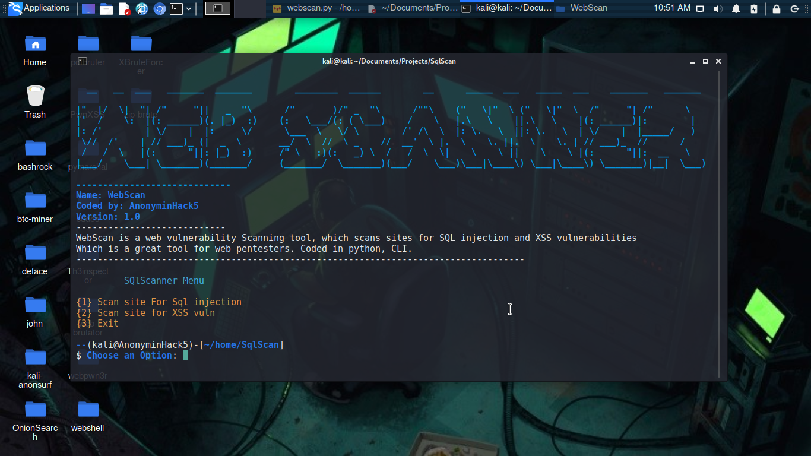

# WebScan
WebScan is a web vulnerability Scanning tool, which scans sites for SQL injection and XSS vulnerabilities
Which is a great tool for web pentesters. Coded in python3, CLI. WebScan is capable of scanning and detecting sql injection vulnerabilities across HTTP and HTTP sites.

#### Author
AnonyminHack5

#### Language
Python3

<p>WebScan first crawls the site analyzing in-depth each file it finds, and displaying the entire website form structure. <b>In the US, Nigeria, no federal law exists to ban port scanning, web scanning. However scanning without permission can get you into trouble</b></p>

# How does WebScan work?
While a network vulnerability scanner scans the web server itself, including its operating system, the webserver daemon and the various other open sources, such as database services running on the same system, WebScan or web application scanner focuses on the code of the application

# WebScan-HOME


<br/>

## Tested On
WebScan has been tested on the following debain and ubuntu based systems and shown to work perfectly

#### [+]Parrot OS security
#### [+]Kali Linux 2021
#### [+]Ubuntu
#### [+]Lubuntu
#### [+]Slax Linux
#### [+]BlackArch Linux
#### [+]And Others....

# Features of WebScan
#### [1]SQL injection scanning support
#### [2]XSS scanning support
#### [3]Good UI
#### [4}Tests for Internet Connection

<p>WebScan was coded with love from my heart, as i have worked on this project for some time</p>

# Requirements
#### [1]Internet Connection (Required!!)
#### [2]bs4
#### [3]Requests
#### [4]termcolor
#### [5]Colorama
#### [6]And Others....

# Demo Video Usage

<br/>

<p>You are also free to download the video for a better understanding of how to use WebScan in your terminal</p>
Feel free to download WebScan. Click <a href="video/WebScan.mp4" target="_blank" alt="" download>here </a> to download.


# How to Install and Use in Any Terminal
```
cd $HOME

git clone https://github.com/TermuxHackz/WebScan.git

cd WebScan

pip install -r requirements.txt

python3 webscan.py
```

<h3> in Addition you can also download vuln sql sites <a href="https://github.com/TermuxHackz/WebScan/blob/master/sql-sites.txt" target="_blank" download> here </a> and vuln xSS site <a href="xss-site.txt" target="_blank" download> here </a></h3>


# Contact Me 
If you notice any bugs or wish to contact me personally, Contact me via my email
<b>AnonyminHack5@protonmail.com</b>

#### Be Ethical
